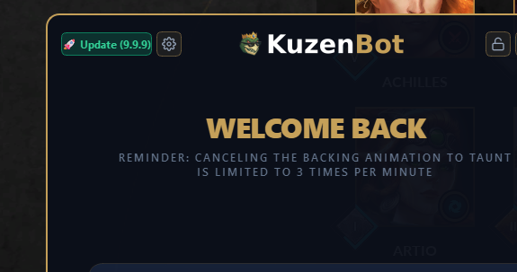
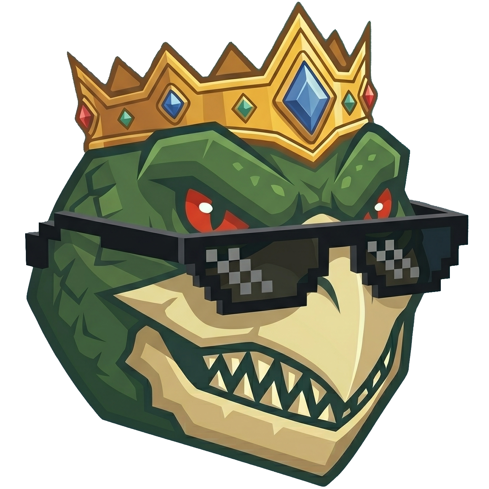

# KuzenBot 🐢⚡

<div align="center">
  <a href="#-english-version">🇬🇧 English</a> • <a href="#-wersja-polska">🇵🇱 Polski</a>
</div>

<p align="center">
  
  
  
  
</p>

<div align="center">
  <h3><a href="https://kicpir99.github.io/KuzenBot/">🌐 Odwiedź oficjalną stronę / Visit official website (Download)</a></h3>
</div>

---

## 🇬🇧 English Version

**KuzenBot** is an advanced, lightweight overlay for Smite 2 players that delivers the best community builds and meta statistics right to your screen, without the need to minimize the game (Alt-Tab).

> ⚠️ **IMPORTANT:** For the overlay to render correctly on top of the game, Smite 2 **must** be running in **Borderless Window** or **Windowed** mode. Exclusive Fullscreen mode will block the overlay from appearing.

<div align="center">
  <h3>🛡️ 100% Safe. Zero game files modification.</h3>
  <p>KuzenBot is an external Windows overlay. It does not inject code into the game memory (Zero Memory Injection) and does not modify any files, making it completely safe to use with Anti-Cheat systems.</p>
</div>

### ✨ Main Features & In-Game Preview

| Feature | Preview |
| :--- | :---: |
| **✨ Flexible Mode (Extended & Mini)**<br>In base? Open Extended to view full item stats. In combat? Switch to Mini – a small tile that doesn't block vision. |  |
| **🤖 Intelligence (AUTO Mode)**<br>The app automatically detects the god you pick in the lobby and instantly loads the dedicated build. |  |
| **🔒 Ghost Mode (Click-Through)**<br>One hotkey locks the overlay – making it transparent to mouse clicks. No more accidental panel clicks instead of casting abilities. |  |
| **📊 Data Flexibility on the Fly**<br>Seamlessly switch between raw item statistics and the most popular community builds. |  |
| **👻 Invisible Interface**<br>Adjust the background opacity down to zero, leaving only clean item icons on the screen. |  |
| **⚙️ Deep Customization**<br>Full control over the UI: precise settings, global hotkeys, and 8 built-in color themes. |  |
| **🚀 Silent Auto-Updater**<br>After every game patch, the app automatically checks GitHub in the background, downloads updates, and offers a 1-click install. |  |

### 🛠️ Tech Stack

* **Language:** Python 3.10+
* **GUI:** PyQt6 (with advanced `QPropertyAnimation` animations)
* **Architecture:** Custom HTTP threading system (`QThread`) with local Caching for instant data loading.
* **Game Integration:** Real-time log analysis.

### 🚀 Getting Started (For Developers)

If you want to run the project from the source:

1. Clone the repository:
   ```bash
   git clone [https://github.com/kicpir99/KuzenBot.git](https://github.com/kicpir99/KuzenBot.git)
   cd KuzenBot

---

<div align="center">
  
  

  # KuzenBot 🐢⚡
  **Koniec z alt+tabem. Build masz przed oczami.**
  
  <p align="center">
    <a href="#-english-version">🇬🇧 English</a> • <a href="#-wersja-polska">🇵🇱 Polski</a>
  </p>

  <p align="center">
    
    
    
    
  </p>

  <h3>
    <a href="https://kicpir99.github.io/KuzenBot/">🌐 Odwiedź oficjalną stronę (Pobierz)</a>
  </h3>

  <i>Lekka, niewykrywalna nakładka (overlay) dla graczy Smite 2, która dostarcza najlepsze buildy prosto na Twój ekran, bez minimalizowania gry.</i>

</div>

---

<div align="center">
  <h3>🛡️ W 100% bezpieczne. Zero modyfikacji plików gry.</h3>
  <p>KuzenBot to zewnętrzna nakładka systemu Windows. Nie wstrzykuje kodu do pamięci gry (Zero Memory Injection) i nie modyfikuje żadnych plików, dzięki czemu jest całkowicie bezpieczna do użytku z systemami Anti-Cheat.</p>
</div>

---

## ✨ Główne Funkcje (Features)

KuzenBot został zaprojektowany z myślą o minimalizmie i wydajności. Poniżej przedstawiamy, co potrafi:

| Funkcja | Podgląd w grze |
| :--- | :---: |
| **✨ Tryb Elastyczny (Extended & Mini)**<br>W bazie rozłóż pełne statystyki itemów. W walce przełącz się na tryb Mini – mały kafelek, który nie zasłania nic ważnego. |  |
| **🤖 Inteligencja (AUTO Mode)**<br>Program automatycznie rozpoznaje wybranego przez Ciebie boga w lobby i natychmiast ładuje dedykowany build. |  |
| **🔒 Ghost Mode (Click-Through)**<br>Jeden skrót zablokuje nakładkę – staje się przezroczysta dla myszki. Koniec z przypadkowym kliknięciem w panel zamiast rzucenia umiejętności. |  |
| **📊 Elastyczność Danych w Locie**<br>Przełączaj się płynnie między statystykami przedmiotów a najpopularniejszymi kompozycjami społeczności. |  |
| **👻 Niewidzialny Interfejs**<br>Dostosuj suwak przezroczystości tła do zera, aby na ekranie wyświetlały się tylko czyste ikony przedmiotów. |  |
| **⚙️ Głęboka Personalizacja**<br>Pełna kontrola nad interfejsem: precyzyjne ustawienia, globalne hotkeye oraz 8 wbudowanych motywów kolorystycznych (Themes). |  |
| **🚀 Cichy Auto-Updater**<br>Po każdym patchu gry aplikacja automatycznie, w tle sprawdzi GitHub, pobierze aktualizacje i zaoferuje instalację jednym kliknięciem. |  |

---

## 🛠️ Informacje dla Programistów (Tech Stack)

Aplikacja została zbudowana na otwartym kodzie źródłowym, co gwarantuje pełną transparentność:

* **Język:** Python 3.10+
* **Interfejs Graficzny:** PyQt6 (z płynnymi animacjami `QPropertyAnimation`)
* **Architektura:** Własny system wątków HTTP (`QThread`) z lokalnym Cache dla natychmiastowego ładowania statystyk.

### 🚀 Jak uruchomić ze źródeł (Local Setup)

1. Sklonuj repozytorium:
```bash
   git clone [https://github.com/kicpir99/KuzenBot.git](https://github.com/kicpir99/KuzenBot.git)
   cd KuzenBot
